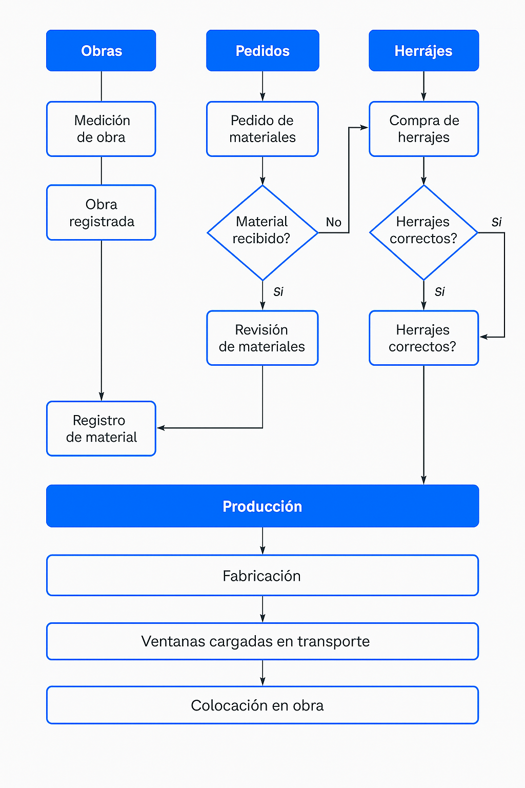

# GUÍA VISUAL Y ESTÁNDARES DE ESTILO (PALETA PASTEL AZUL-CREMA, CONTRASTE Y SOMBRAS)


> **Tabla de contenido**
>
> 1. [Guía visual y estándares de estilo](#guía-visual-y-estándares-de-estilo-paleta-pastel-azul-crema-contraste-y-sombras)
> 2. [Principios y parámetros de diseño UI/UX](#principios-y-parámetros-de-diseño-uiux-para-toda-la-app)
> 3. [Instrucciones de instalación y configuración](#instrucciones-de-instalación-y-configuración)
> 4. [Variables globales y configuración](#configuración-de-variables-globales)
> 5. [Estructura y orden de tablas de base de datos](#estructura-y-orden-de-columnas-requeridas-para-tablas-principales)
> 6. [Patrones obligatorios de tablas y responsive](#patrón-universal-de-tablas-responsive-qtablewidget)
> 7. [Integración UI + Base de Datos y flujos](#integración-ui--base-de-datos-verificación-automática)
> 8. [Gestión de permisos y aprobaciones](#gestión-de-permisos-visibilidad-de-módulos-y-aprobaciones-admin-supervisor-usuario)
> 9. [Errores comunes y soluciones robustas](#errores-comunes-detectados-y-soluciones-aplicadas-en-vistas-principales-2025-05)
> 10. [Configuración y seguridad de la conexión a la base de datos](#configuración-y-seguridad-de-la-conexión-a-la-base-de-datos)

---

# Guía visual y estándares de estilo (paleta pastel azul-crema, contraste y sombras)

La aplicación utiliza una paleta pastel moderna basada en azules y cremas, con alto contraste y detalles de sombra para lograr una experiencia visual clara, profesional y agradable. Todos los módulos y widgets deben seguir estos lineamientos visuales y de estilo.

## Paleta de colores principal

- **Fondo general:** `#fff9f3` (crema pastel muy claro)
- **Azul pastel principal:** `#2563eb` (para texto, íconos y botones principales)
- **Celeste pastel:** `#e3f6fd` (fondos de botones y headers)
- **Lila pastel:** `#f3eaff` (hover de botones)
- **Rosa pastel:** `#ffe5e5` (selección y feedback)
- **Verde pastel:** `#d1f7e7` (estado online, éxito)
- **Rojo pastel:** `#ffe5e5` (errores, offline)
- **Gris pastel:** `#e3e3e3` (bordes, líneas de tabla)

## Contraste y accesibilidad

- El texto y los íconos siempre usan azul pastel `#2563eb` sobre fondo claro para máximo contraste.
- Los mensajes de error usan rojo pastel `#ef4444` sobre fondo claro.
- Los botones principales tienen fondo celeste pastel y texto azul pastel.
- Los diálogos y widgets tienen bordes redondeados y sombra sutil para destacar sobre el fondo.

## Botones modernos y sombras

- Todos los botones usan bordes redondeados de 8px, sombra sutil y colores pastel.
- El helper `estilizar_boton_icono` aplica tamaño, color y sombra uniforme a los botones con ícono.
- Ejemplo visual de botón principal:

```css
QPushButton {
    background-color: #e3f6fd;
    color: #2563eb;
    border: 1px solid #e3e3e3;
    padding: 8px 16px;
    font-size: 13px;
    font-weight: bold;
    min-width: 80px;
    min-height: 28px;
    box-shadow: 0 2px 8px rgba(37,99,235,0.08); /* sombra sutil */
}
QPushButton:hover {
    background-color: #f3eaff;
}
QPushButton:pressed {
    background-color: #ffe5e5;
}
```

## Ejemplo de helper para botones con ícono (Python)

```python
from PyQt6.QtWidgets import QPushButton
from PyQt6.QtCore import QSize

def estilizar_boton_icono(boton: QPushButton, tam_icono: int = 20, tam_boton: int = 32):
    boton.setIconSize(QSize(tam_icono, tam_icono))
    boton.setFixedSize(tam_boton, tam_boton)
    boton.setStyleSheet(
        """
        QPushButton {
            background-color: #e3f6fd;
            color: #2563eb;
            border-radius: 8px;
            border: 1.5px solid #e3e3e3;
            font-weight: bold;
            box-shadow: 0 2px 8px rgba(37,99,235,0.08);
        }
        QPushButton:hover {
            background-color: #f3eaff;
        }
        QPushButton:pressed {
            background-color: #ffe5e5;
        }
        """
    )
```

## Ejemplo visual de tabla y headers

```css
QTableWidget {
    background-color: #fff9f3;
    color: #2563eb;
    gridline-color: #e3e3e3;
    border: 1px solid #f6faff;
}
QTableWidget QHeaderView::section {
    background-color: #e3f6fd;
    color: #2563eb;
    font-weight: bold;
    border-radius: 8px;
    padding: 8px;
    border: 1px solid #e3e3e3;
}
```

## Sombra y profundidad

- Los widgets principales y diálogos usan sombra sutil para dar profundidad y separar visualmente del fondo.
- Ejemplo de sombra en QSS:

```css
QWidget, QDialog, QFrame, QPushButton, QTableWidget, QLabel {
    border-radius: 12px;
    box-shadow: 0 2px 8px rgba(37,99,235,0.08);
}
```

---

## PRINCIPIOS Y PARÁMETROS DE DISEÑO UI/UX PARA TODA LA APP

Estos lineamientos deben aplicarse SIEMPRE al crear cualquier ventana, diálogo, botón, label, input, tabla, etc.
Si se requiere una excepción, debe justificarse y documentarse.

1. Padding y márgenes:
   - Padding mínimo en diálogos y widgets: 20px vertical, 24px horizontal.
   - Márgenes entre elementos: mínimo 16px.
   - Los cuadros de diálogo deben estar perfectamente centrados y con el mismo espacio a ambos lados.
2. Bordes y esquinas:
   - Bordes redondeados: 8-12px en todos los diálogos, botones y campos de entrada.
3. Tipografía:
   - Fuente: Segoe UI, Roboto, o similar sans-serif.
   - Tamaño base: 11px para mensajes secundarios, 13px para principales, 14px para títulos.
   - Peso: 500-600 para títulos y botones, 400-500 para textos normales.
   - Color de texto: #1e293b para texto principal, #ef4444 para errores, #2563eb para info, #22c55e para éxito, #fbbf24 para advertencia.
   - El texto debe estar centrado vertical y horizontalmente en diálogos y botones.
4. Botones:
   - Ancho mínimo: 80px, alto mínimo: 28px.
   - Padding horizontal: 16px.
   - Bordes redondeados: 8px.
   - Color de fondo: #2563eb para acción principal, #f1f5f9 para secundarios.
   - Color de texto: blanco en botones primarios, #1e293b en secundarios.
   - Espaciado entre botones: 16px.
5. Colores y fondo:
   - Fondo general: #f1f5f9.
   - Los diálogos de error usan #ef4444 para el texto y fondo claro.
   - Los mensajes de éxito usan #22c55e, advertencia #fbbf24, info #2563eb.
6. Íconos:
   - Siempre SVG o PNG de alta resolución.
   - Alineados con el texto y con padding de al menos 8px respecto al texto.
7. Tablas y formularios:
   - Espaciado entre filas: mínimo 8px.
   - Padding en celdas: 12px.
   - Bordes redondeados en headers y celdas: 8px.
   - No saturar de información, usar scroll y paginación si es necesario.
8. Feedback visual:
   - Mensajes breves, claros y con color adecuado.
   - Siempre usar QMessageBox o widgets personalizados con los estilos definidos.
   - El feedback debe ser inmediato tras la acción del usuario.
9. Accesibilidad:
   - Contraste alto entre texto y fondo.
   - No usar solo color para indicar estado (agregar íconos o texto).
   - Tamaños de fuente nunca menores a 10px.
10. Código:
    - Centralizar estilos en QSS global o helpers.
    - No hardcodear estilos en cada widget, salvo casos justificados.
    - Reutilizar componentes visuales y helpers para mantener coherencia.
    - Documentar cualquier excepción a estas reglas.

---

Estos principios son OBLIGATORIOS para todo el desarrollo de la app. Si se requiere una excepción, debe estar documentada en el código y en este archivo.

## Instrucciones de Instalación y Configuración

### Requisitos Previos

- Python 3.8 o superior
- PostgreSQL 12 o superior
- Librería `pyodbc` para la conexión a SQL Server.
- Controlador ODBC para SQL Server (recomendado: **ODBC Driver 17 for SQL Server**).

### Pasos para la Instalación

1. Clonar el repositorio:

   ```bash
   git clone <URL_DEL_REPOSITORIO>
   cd stock.admin
   ```

2. Crear y activar un entorno virtual:

   ```bash
   python -m venv venv
   source venv/bin/activate   # En Windows: venv\Scripts\activate
   ```

3. Instalar las dependencias:

   ```bash
   pip install -r requirements.txt
   ```

   Asegúrate de que `pyodbc` esté incluido en el archivo `requirements.txt`. Si no, instálalo manualmente:

   ```bash
   pip install pyodbc
   ```

4. Instalar el controlador ODBC para SQL Server:
   - Descarga e instala el controlador desde [Microsoft ODBC Driver for SQL Server](https://learn.microsoft.com/en-us/sql/connect/odbc/download-odbc-driver-for-sql-server).

5. Configurar la base de datos:
   - Crear las bases de datos necesarias ejecutando el script `MPS_SQL_COMPLETO_SIN_PREFIJOS.sql` en PostgreSQL.
   - Configurar las credenciales de la base de datos en el archivo `core/database.py`.

6. Ejecutar el proyecto:

   ```bash
   python main.py
   ```

### Configuración de Variables Globales

El sistema permite configurar variables globales desde el archivo `core/config.py` o desde el módulo de configuración en la aplicación.

### Variables Disponibles

#### Conexión a la Base de Datos

- **DB_SERVER**: Dirección o IP del servidor SQL.
- **DB_USERNAME**: Usuario de la base de datos.
- **DB_PASSWORD**: Contraseña del usuario.
- **DB_PORT**: Puerto del servidor SQL (por defecto: 1433).
- **DB_DEFAULT_DATABASE**: Base de datos predeterminada.
- **DB_TIMEOUT**: Tiempo de espera para la conexión (en segundos).

#### Configuración General

- **DEBUG_MODE**: Activar o desactivar modo de depuración.
- **FILE_STORAGE_PATH**: Ruta para almacenar archivos generados.
- **DEFAULT_LANGUAGE**: Idioma predeterminado de la aplicación.
- **DEFAULT_TIMEZONE**: Zona horaria predeterminada.
- **NOTIFICATIONS_ENABLED**: Activar o desactivar notificaciones globales.

### Edición desde la Aplicación

Estas configuraciones también pueden ser modificadas desde el módulo de configuración, en las pestañas "General" y "Base de Datos".

### Configuración de Conexión a la Base de Datos

El archivo `core/config.py` contiene información sensible como credenciales de la base de datos. **No debe subirse al repositorio**. Asegúrate de que esté incluido en el archivo `.gitignore`.

Si necesitas compartir configuraciones genéricas, utiliza un archivo de ejemplo como `config.example.py` y excluye las credenciales reales.

Para configurar las credenciales de conexión a la base de datos, edita el archivo `core/config.py` y define los valores correspondientes:

```python
# filepath: c:\Users\Escorpio\Desktop\Martin\Proyectos\stock.app\core\config.py
DB_SERVER = "192.168.1.100"  # Dirección o IP del servidor SQL
DB_USERNAME = "sa"           # Usuario de la base de datos
DB_PASSWORD = "mps.1887"     # Contraseña del usuario
```

### Notas

- Asegúrate de que el servidor SQL permita conexiones remotas.
- Si cambias el puerto predeterminado (1433), incluye el puerto en `DB_SERVER`, por ejemplo: "192.168.1.100,1434".
- No compartas este archivo públicamente, ya que contiene información sensible.

### Configuración Inicial

- Crear un usuario administrador desde el módulo de usuarios.
- Configurar los parámetros iniciales en el módulo de configuración.

### Notas sobre la Conexión a la Base de Datos

El sistema ahora utiliza `pyodbc` para conectarse a SQL Server. Asegúrate de que el controlador ODBC esté instalado y configurado correctamente.

---

## Configuración y Seguridad de la Conexión a la Base de Datos

### Seguridad y buenas prácticas
- **Nunca expongas usuario, contraseña ni IP en el código fuente de los módulos.**
- Todos los datos sensibles de conexión se encuentran en `core/config.py` y solo deben modificarse allí.
- El string de conexión se construye siempre usando la función `get_connection_string(driver, database)` de `core/database.py`.
- No se deben hardcodear strings de conexión ni credenciales en scripts, módulos ni notebooks.
- El archivo `core/config.py` **no debe subirse al repositorio**. Usa `config.example.py` para compartir ejemplos.

### Conexión multi-PC y configuración visual
- El sistema permite conectarse desde varias computadoras a la PC/servidor donde están las bases de datos.
- Desde el módulo de Configuración, pestaña "Base de Datos", puedes:
  - Ver y editar la IP/servidor, usuario, contraseña y base de datos.
  - Probar la conexión antes de guardar los cambios.
  - Guardar la configuración en la base de datos para que persista entre sesiones.
  - Ver un tutorial visual que explica:
    - Cómo encontrar la IP del servidor (ejemplo: ejecutar `ipconfig` en la PC del servidor).
    - Qué poner en cada campo según el caso (red local, remoto, instancia local, etc.).
    - Qué hacer si falla la conexión (verificar firewall, usuario, contraseña, permisos de SQL Server, etc.).

### Ejemplo de flujo para el usuario
1. Ir a Configuración > Base de Datos.
2. Cambiar la IP/servidor si es necesario (por ejemplo, la IP de la PC donde está SQL Server).
3. Ingresar usuario y contraseña de SQL Server.
4. Seleccionar la base de datos a la que se quiere conectar (por ejemplo, `inventario`, `usuarios`, etc.).
5. Probar la conexión con el botón correspondiente.
6. Si la conexión es exitosa, guardar los cambios. La configuración quedará guardada y se usará en los próximos inicios.

### Notas técnicas
- El sistema utiliza una única conexión persistente por base de datos, inyectada en los modelos.
- Si la conexión falla, la app muestra un aviso y permite navegación básica en modo offline.
- Todas las acciones relevantes quedan registradas en auditoría.
- Los tests de conexión y guardado de configuración están cubiertos en los tests automáticos.

---

## Cambios recientes en la gestión de conexión
- Se unificó el uso de la función `get_connection_string` para evitar exposición de credenciales.
- Se corrigieron nombres de bases de datos y argumentos en los constructores de conexión.
- Se agregó la posibilidad de editar y guardar la configuración de conexión desde la app.
- Se agregó un tutorial visual y validación de conexión en el módulo de Configuración.
- Se documentó el flujo y las buenas prácticas en este README.

---

## Bases de Datos y Tablas Existentes

### Bases de Datos

1. **mps.app-inventario**
2. **mps.app-users**

---

### Tablas en `mps.app-inventario`

- **dbo.estado_herrajes**: Estado de los herrajes.
- **dbo.historial**: Historial de movimientos o cambios.
- **dbo.inventario**: Inventario general de herrajes.
- **dbo.herrajes**: Detalles de los herrajes.
- **dbo.herrajes_proveedores**: Relación entre herrajes y proveedores.
- **dbo.movimientos_inventario**: Movimientos registrados en el inventario.
- **dbo.obras**: Información de las obras.
- **dbo.obras_materiales**: Relación entre obras y herrajes asignados.
- **dbo.obra_materiales**: Detalles específicos de herrajes por obra.
- **dbo.pedidos**: Pedidos realizados (ahora gestionados dentro del módulo Compras).
- **dbo.pedidos_pendientes**: Pedidos que aún no han sido completados (parte del módulo Compras).
- **dbo.pedidos_por_obra**: Pedidos relacionados con obras específicas.
- **dbo.perfiles_por_obra**: Perfiles asignados a obras.
- **dbo.proveedores**: Información de los proveedores.

---

### Tablas en `mps.app-users`

- **dbo.usuarios**: Información de los usuarios registrados.

---

### Conexión persistente a la Base de Datos

- Todas las operaciones de base de datos utilizan ahora la clase `BaseDatabaseConnection` y sus derivadas para mantener una única conexión persistente.
- Se ha descontinuado el uso de la clase `DatabaseConnection`, que abría y cerraba conexiones por cada consulta.
- Cada módulo debe instanciar su propia conexión específica (por ejemplo, `InventarioDatabaseConnection`, `ObrasDatabaseConnection`, etc.).
- Esto evita conexiones duplicadas, reduce la sobrecarga y mejora el rendimiento general del sistema.

---

### Notas Importantes

1. **Nombres de Tablas**: Solo se deben usar los nombres de tablas existentes. No se deben crear tablas con nombres diferentes sin previa consulta y aprobación.
2. **Creación de Nuevas Tablas**: Si se necesita crear una nueva tabla, consulta primero y espera la aprobación antes de proceder.
3. **Consistencia**: Asegúrate de que las consultas y operaciones en la base de datos utilicen los nombres exactos de las tablas listadas aquí.

---

Si necesitas agregar más información o realizar cambios en las bases de datos, por favor consulta con el equipo antes de proceder.

## Instrucciones para aplicar el script de estructura de tablas

Para garantizar que todas las tablas críticas del sistema tengan la estructura, el orden y los campos correctos, utiliza el script unificado `scripts/estructura_tablas_mps.sql`.

### ¿Qué hace este script?

- Elimina (si existen) y crea desde cero todas las tablas principales de inventario, usuarios, obras, auditoría, permisos y solicitudes de aprobación, con el orden y tipos de columnas requeridos por el sistema y los tests.
- Es compatible con SQL Server (puedes adaptarlo fácilmente para PostgreSQL cambiando los tipos y funciones de autoincremento).

### ¿Cómo aplicarlo?

1. **Haz un respaldo de tus datos actuales** si tienes información importante en las tablas.
2. Abre SQL Server Management Studio (SSMS) o tu herramienta de administración de base de datos.
3. Abre el archivo `scripts/estructura_tablas_mps.sql`.
4. Ejecuta el script en cada base de datos correspondiente:
   - Para la base de datos de inventario.
   - Para la base de datos de usuarios.
   - Para la base de datos de auditoría.
   - (Y cualquier otra base relevante que uses en tu sistema).
5. Verifica que las tablas se hayan creado correctamente y que el orden de columnas coincida con lo documentado.

### Notas importantes

- El script elimina las tablas si existen, por lo que **borra todos los datos previos**. Úsalo solo en entornos de desarrollo o tras hacer un backup.
- Si necesitas migrar datos legacy, primero exporta la información, luego impórtala respetando el nuevo orden de columnas.
- Si usas PostgreSQL, reemplaza `IDENTITY(1,1)` por `SERIAL` o `GENERATED ALWAYS AS IDENTITY`, y ajusta los tipos de fecha/hora.

---

## Resumen de Flujo, Estructura y Relaciones de Datos (2025)

### Estructura General del Sistema

- **Arquitectura modular**: cada módulo (Inventario, Obras, Usuarios, Logística, Compras, etc.) tiene su propio modelo, vista y controlador.
- **Conexión a base de datos centralizada**: se crea una única conexión persistente por base de datos y se inyecta en los modelos, evitando conexiones redundantes.
- **Auditoría y permisos**: todas las acciones relevantes pasan por un decorador que valida permisos y registra auditoría.
- **Interfaz visual unificada**: cada módulo tiene un solo botón principal de acción, con icono SVG y sombra, y el sidebar es visual y minimalista.

### Flujo de Trabajo Digitalizado

1. **Inventario**: permite alta, ajuste, reserva y consulta de materiales/herrajes. Cada movimiento queda registrado en auditoría.
2. **Obras**: permite crear obras, asociar materiales, y visualizar el cronograma tipo Kanban. El usuario puede agregar obras, asignar materiales y ver el estado de avance.
3. **Asociación de materiales a obras**: desde el módulo Obras, se pueden asignar materiales a cada obra, especificando cantidades y estado. Esto se refleja en la tabla `materiales_por_obra`.
4. **Cronograma Kanban**: cada obra tiene una fecha de medición y una fecha de entrega (editable, por defecto 90 días). El Kanban muestra visualmente el avance y permite identificar fechas clave.
5. **Exportación y reportes**: los módulos permiten exportar datos a Excel y PDF.
6. **Gestión de usuarios y permisos**: los roles definen qué acciones puede realizar cada usuario.

### Principales Tablas y Relaciones

- **inventario_items**: ítems/materiales disponibles en stock.
- **movimientos_stock**: historial de movimientos de stock (ingresos, egresos, ajustes, reservas).
- **reservas_stock**: reservas de materiales para obras.
- **obras**: datos principales de cada obra (nombre, cliente, estado, fecha de medición, fecha de entrega).
- **materiales_por_obra**: relación N a N entre obras y materiales, con cantidades y estado.
- **cronograma_obras**: etapas y fechas programadas/realizadas para cada obra.
- **usuarios**: usuarios del sistema y sus roles.
- **auditorias_sistema**: registro de todas las acciones relevantes.

#### Relación de datos clave

- Una obra puede tener muchos materiales asociados (`materiales_por_obra`).
- Cada material puede estar asociado a muchas obras.
- El cronograma de cada obra se almacena en `cronograma_obras`.
- Los movimientos de stock y reservas se vinculan a obras y usuarios.

### Lógica de Asociación y Cronograma

- Al crear una obra, se puede definir la fecha de entrega (por defecto 90 días desde la medición, editable).
- Al asignar materiales, se crea un registro en `materiales_por_obra`.
- El Kanban se alimenta de la tabla `obras` y muestra nombre, cliente, fecha de medición y fecha de entrega.
- El usuario puede editar la fecha de entrega y los materiales asociados desde la interfaz.

### Ejemplo de SQL relevante

```sql
CREATE TABLE obras (
    id SERIAL PRIMARY KEY,
    nombre VARCHAR(100),
    cliente VARCHAR(100),
    estado VARCHAR(50),
    fecha DATE, -- fecha de medición
    fecha_entrega DATE -- fecha de entrega (editable)
);

CREATE TABLE materiales_por_obra (
    id SERIAL PRIMARY KEY,
    id_obra INT REFERENCES obras(id),
    id_item INT,
    cantidad_necesaria DECIMAL,
    cantidad_reservada DECIMAL,
    estado VARCHAR(30)
);
```

### Notas sobre la implementación

- El sistema evita conexiones redundantes a la base de datos.
- Todas las acciones importantes quedan registradas en auditoría.
- El flujo de trabajo es digital, modular y auditable.
- La interfaz es moderna, con botones principales únicos y sidebar visual.

---

## MUSTS del proyecto

- **Sincronización automática de columnas:**  
  Todas las vistas que muestran datos de tablas SQL deben obtener los headers (nombres de columnas) automáticamente desde la base de datos al iniciar.  
  No se deben definir headers manualmente en el código, salvo fallback temporal.  
  Si la estructura de la tabla cambia, la vista debe reflejarlo automáticamente.

- **Persistencia de configuración de columnas por usuario:**  
  Cada usuario puede elegir qué columnas ver u ocultar en las tablas.  
  Esta configuración se guarda (por ejemplo, en un archivo JSON) y se restaura automáticamente en la próxima sesión del usuario.

- **Prohibido desincronizar headers:**  
  No puede haber desincronización entre los headers de la vista y los de la tabla SQL.  
  Si se modifica la estructura de una tabla, la vista debe actualizarse automáticamente.

- **Nombres y orden de columnas:**  
  Los nombres y el orden de las columnas en la vista deben coincidir exactamente con los de la tabla SQL correspondiente.

- **Ejemplo de obtención dinámica de headers:**

  ```python
  # Ejemplo para obtener headers desde la base de datos
  query = "SELECT TOP 0 * FROM inventario_perfiles"
  cursor.execute(query)
  headers = [column[0] for column in cursor.description]
  ```

- **Tabla principal del módulo inventario:**  
  Al ingresar al módulo inventario, se debe mostrar la tabla `inventario_perfiles` con los siguientes headers (columnas):

  ```text
  id, codigo, descripcion, tipo, acabado, numero, vs, proveedor,
  longitud, ancho, alto, necesarias, stock, faltan, ped_min, emba, pedido, importe
  ```

> **Estas reglas son obligatorias para todos los módulos y vistas del proyecto.**

## Estructura y orden de columnas requeridas para tablas principales

### Tabla `inventario_perfiles`

El sistema y los tests requieren que la tabla `inventario_perfiles` tenga exactamente las siguientes columnas y en este orden:

1. id (INT, PRIMARY KEY, IDENTITY/AUTOINCREMENT)
2. codigo (VARCHAR, UNIQUE, NOT NULL)
3. descripcion (VARCHAR o TEXT)
4. tipo (VARCHAR)
5. acabado (VARCHAR)
6. numero (VARCHAR o INT)
7. vs (VARCHAR)
8. proveedor (VARCHAR)
9. longitud (DECIMAL o VARCHAR)
10. ancho (DECIMAL o VARCHAR)
11. alto (DECIMAL o VARCHAR)
12. necesarias (DECIMAL o INT)
13. stock (DECIMAL o INT)
14. faltan (DECIMAL o INT)
15. ped_min (DECIMAL o INT)
16. emba (VARCHAR)
17. pedido (VARCHAR)
18. importe (DECIMAL)

- El tipo de dato puede ajustarse según la necesidad, pero el orden debe ser exactamente este.
- Si alguna columna no se usa aún, igual debe estar presente (puede ser NULL por defecto).
- Si tienes otras tablas similares (por ejemplo, para obras, materiales, etc.), sigue el mismo criterio: define y documenta el orden y los nombres exactos de las columnas requeridas por el modelo y la UI.

> **IMPORTANTE:** Si la tabla ya existe y el orden físico de las columnas no coincide, se recomienda crear una nueva tabla temporal con el orden correcto, migrar los datos y renombrar la tabla. Esto es fundamental para que el sistema y los tests funcionen correctamente.

### Ejemplo de SQL para crear la tabla con el orden correcto

```sql
CREATE TABLE inventario_perfiles (
    id INT IDENTITY(1,1) PRIMARY KEY,
    codigo VARCHAR(100) UNIQUE NOT NULL,
    descripcion VARCHAR(255),
    tipo VARCHAR(50),
    acabado VARCHAR(50),
    numero VARCHAR(50),
    vs VARCHAR(50),
    proveedor VARCHAR(100),
    longitud DECIMAL(18,2),
    ancho DECIMAL(18,2),
    alto DECIMAL(18,2),
    necesarias DECIMAL(18,2),
    stock DECIMAL(18,2),
    faltan DECIMAL(18,2),
    ped_min DECIMAL(18,2),
    emba VARCHAR(50),
    pedido VARCHAR(100),
    importe DECIMAL(18,2)
);
```

Asegúrate de replicar este patrón para cualquier otra tabla crítica del sistema (por ejemplo, obras, materiales, etc.) y documentar el orden de columnas en este README.

---

## Requerimiento obligatorio de tablas

Todas las tablas del sistema (QTableWidget) deben permitir:

- Mostrar/ocultar columnas mediante menú contextual en el encabezado.

- Ajustar el ancho de columnas manualmente y autoajustar con doble clic.

- Persistir las preferencias de visibilidad y ancho de columnas por usuario/sesión (archivo JSON).

Este patrón debe aplicarse a todos los módulos que presenten tablas.

---

## Patrón universal de tablas responsive (QTableWidget)

Todas las tablas principales de la aplicación (QTableWidget) deben aplicar el mixin `TableResponsiveMixin` y el método `make_table_responsive` para garantizar que la tabla se expanda y adapte correctamente al modo fullscreen o maximizado, tanto en ancho como en alto.

**Ejemplo de uso:**

```python
from core.table_responsive_mixin import TableResponsiveMixin

class MiVista(QWidget, TableResponsiveMixin):
    def __init__(self):
        super().__init__()
        self.tabla = QTableWidget()
        self.make_table_responsive(self.tabla)
        # ...
```

Esto asegura una experiencia de usuario moderna y consistente en todos los módulos.

---

## Integración UI + Base de Datos: verificación automática

Cada operación relevante sobre datos (agregar, editar, eliminar, exportar, etc.) debe reflejarse tanto en la base de datos como en la UI (tabla principal). Esto se verifica mediante tests de integración automáticos que:

- Simulan operaciones sobre el modelo (mock DB).
- Simulan la actualización de la tabla en la vista (mock UI).
- Verifican que los datos insertados/actualizados/eliminados aparecen correctamente en ambos lugares.

**Ejemplo de test de integración:**

```python
class MockDBConnection:
    # ... implementación ...

class MockVista:
    def actualizar_tabla(self, data):
        self.tabla_data = data

class TestModuloIntegracion(unittest.TestCase):
    def setUp(self):
        self.mock_db = MockDBConnection()
        self.model = MiModelo(self.mock_db)
        self.view = MockVista()
    def test_agregar_y_reflejar(self):
        self.model.agregar_algo(datos)
        items = self.mock_db.ejecutar_query("SELECT * FROM tabla")
        self.view.actualizar_tabla(items)
        self.assertEqual(self.view.tabla_data, items)
```

Este patrón es obligatorio para todos los módulos y garantiza robustez y trazabilidad en la experiencia del usuario y la integridad de los datos.

---

## Patrón de solicitudes de aprobación para acciones de usuario (ISO/SAP-like)

- Cuando un usuario con rol "usuario" intenta realizar una acción de modificación (agregar, editar, eliminar), la acción no se ejecuta directamente.
- En su lugar, se crea una solicitud pendiente en la tabla `solicitudes_aprobacion` con los datos de la acción y el usuario solicitante.
- El usuario recibe feedback visual indicando que la acción está pendiente de aprobación.
- Los supervisores pueden ver, aprobar o rechazar estas solicitudes desde la UI (por ejemplo, en el módulo Notificaciones o una pestaña especial).
- Solo tras la aprobación del supervisor, la acción se ejecuta realmente y se registra en auditoría.
- Todo el flujo queda trazado y auditable, cumpliendo la norma ISO y el estándar SAP-like.

**Estructura SQL:**

```sql
CREATE TABLE solicitudes_aprobacion (
    id SERIAL PRIMARY KEY,
    id_usuario INT REFERENCES usuarios(id),
    modulo VARCHAR(50) NOT NULL,
    tipo_accion VARCHAR(30) NOT NULL, -- agregar, editar, eliminar
    datos_json TEXT NOT NULL,         -- datos de la acción en formato JSON
    estado VARCHAR(20) DEFAULT 'pendiente', -- pendiente, aprobada, rechazada
    fecha_solicitud TIMESTAMP DEFAULT CURRENT_TIMESTAMP,
    fecha_resolucion TIMESTAMP,
    resuelto_por INT REFERENCES usuarios(id),
    observaciones TEXT
);
```

**Ejemplo de flujo:**

1. Usuario intenta editar un material en Inventario.
2. Se crea una solicitud en `solicitudes_aprobacion` con estado "pendiente".
3. El supervisor ve la solicitud y la aprueba o rechaza desde la UI.
4. Si aprueba, se ejecuta la acción y se registra en auditoría; si rechaza, se notifica al usuario.

> Este patrón es obligatorio para trazabilidad, cumplimiento normativo y robustez en la gestión de acciones críticas.

---

## Gestión avanzada de permisos y visibilidad de módulos (estructura recomendada)

### Estructura de permisos flexible y escalable

Para garantizar una gestión robusta, auditable y escalable de los permisos y la visibilidad de módulos, se implementa una tabla separada `permisos_modulos` en la base de datos. Esta estructura permite asignar permisos granulares por usuario y módulo, y es fácilmente extensible a roles.

#### SQL recomendado

```sql
CREATE TABLE permisos_modulos (
    id SERIAL PRIMARY KEY,
    id_usuario INT REFERENCES usuarios(id),
    modulo VARCHAR(50) NOT NULL,
    puede_ver BOOLEAN DEFAULT TRUE,
    puede_modificar BOOLEAN DEFAULT FALSE,
    puede_aprobar BOOLEAN DEFAULT FALSE,
    fecha_creacion TIMESTAMP DEFAULT CURRENT_TIMESTAMP,
    creado_por INT REFERENCES usuarios(id)
);
```

- **id_usuario**: Relaciona el permiso con un usuario específico.
- **modulo**: Nombre del módulo (ej: 'inventario', 'obras', 'logistica', etc.).
- **puede_ver / puede_modificar / puede_aprobar**: Permisos granulares por acción.
- **fecha_creacion / creado_por**: Trazabilidad y auditoría de cambios.

#### Ejemplo de consulta de permisos por usuario

```sql
SELECT modulo, puede_ver, puede_modificar, puede_aprobar
FROM permisos_modulos
WHERE id_usuario = ?;
```

#### Extensión a permisos por rol (opcional, recomendado para sistemas grandes)

1. Crear tabla `roles` (id, nombre)
2. Crear tabla `roles_permisos` (id, id_rol, modulo, puede_ver, puede_modificar, puede_aprobar)
3. Relacionar usuarios con roles (columna id_rol en `usuarios`)
4. Al consultar permisos, combinar los de usuario y rol (el permiso de usuario tiene prioridad sobre el de rol)

#### Ventajas de este enfoque

- Permite agregar nuevos módulos o acciones sin modificar la tabla de usuarios.
- Facilita la administración y auditoría de permisos.
- Escalable y compatible con flujos de aprobación y visibilidad SAP-like.
- Permite UI de configuración flexible (checkboxes por usuario/rol y módulo).

#### Implementación en la aplicación

- Al iniciar sesión, se cargan los permisos desde `permisos_modulos` y se construye el sidebar y la navegación solo con los módulos permitidos.
- El módulo de Configuración permite al admin gestionar estos permisos de forma visual.
- Todas las acciones sensibles validan permisos antes de ejecutarse y registran en auditoría.

> **Este patrón es obligatorio para cumplir con los estándares de seguridad, trazabilidad y experiencia SAP-like del sistema.**

---

## Gestión de Permisos, Visibilidad de Módulos y Aprobaciones (Admin, Supervisor, Usuario)

### Objetivo

Implementar un sistema robusto de permisos y visibilidad de módulos, donde:

- **Admin**: Puede ver y acceder a todos los módulos, y definir qué módulos pueden ver los supervisores y usuarios.
- **Supervisor**: Puede ver los módulos habilitados por el admin y realizar modificaciones, pero no puede cambiar la visibilidad global de módulos.
- **Usuario**: Solo puede ver los módulos habilitados por el admin y supervisores, y NO puede realizar modificaciones sin aprobación de un supervisor.

### Requerimientos Técnicos y de UI/UX

#### 1. Estructura de Permisos y Visibilidad

- Crear una tabla o archivo de configuración (`permisos_modulos` o similar) que relacione usuarios/roles con los módulos visibles y permisos de acción (ver, modificar, aprobar).
- Al iniciar sesión, cargar la configuración de permisos y construir el sidebar y el QStackedWidget solo con los módulos permitidos para ese usuario.
- El admin debe tener acceso a una interfaz en el módulo de Configuración para gestionar la visibilidad de módulos por usuario y rol (checkboxes por módulo y usuario/rol).

#### 2. Lógica de Aprobación y Modificación

- Los usuarios con rol "usuario" pueden ver datos, pero cualquier acción de modificación (agregar, editar, eliminar) debe requerir la aprobación de un supervisor.
- Implementar un flujo de aprobación:
  - El usuario realiza una solicitud de modificación (por ejemplo, editar un material).
  - La acción queda "pendiente de aprobación" y se notifica a los supervisores (por ejemplo, en el módulo Notificaciones).
  - Un supervisor puede aprobar o rechazar la solicitud. Solo al aprobarse, la acción se ejecuta realmente en la base de datos y la UI.
  - Todas las solicitudes y aprobaciones deben quedar registradas en Auditoría.

#### 3. UI/UX para Permisos y Aprobaciones

- En el módulo Configuración, agregar una pestaña "Permisos y visibilidad" donde el admin pueda:
  - Ver la lista de usuarios y roles.
  - Marcar/desmarcar qué módulos puede ver cada usuario/rol (checkboxes por módulo).
  - Definir qué acciones puede realizar cada rol (ver, modificar, aprobar).
- En la UI de cada módulo:
  - Si el usuario no tiene permiso de modificación, los botones de acción (agregar, editar, eliminar) deben estar deshabilitados o no visibles.
  - Si un usuario realiza una acción que requiere aprobación, mostrar un mensaje visual indicando que la acción está pendiente de aprobación.
  - Los supervisores deben ver una lista de solicitudes pendientes y poder aprobar/rechazar desde la UI.
- El admin siempre puede ver y modificar todo.

#### 4. Persistencia y Seguridad

- Guardar la configuración de permisos y visibilidad de forma persistente (en base de datos o archivo seguro).
- Validar los permisos en backend y frontend para evitar bypass por manipulación de la UI.
- Registrar en Auditoría todos los intentos de acción no permitida, solicitudes de aprobación, aprobaciones y rechazos.

#### 5. Checklist de Implementación

- [ ] Crear modelo de permisos y visibilidad de módulos por usuario/rol.
- [ ] Adaptar la construcción del sidebar y QStackedWidget según permisos cargados al login.
- [ ] Implementar la pestaña de "Permisos y visibilidad" en Configuración para el admin.
- [ ] Deshabilitar/ocultar botones de acción según permisos en cada módulo.
- [ ] Implementar flujo de solicitudes de modificación y aprobación para usuarios.
- [ ] Notificar a supervisores de solicitudes pendientes y permitir aprobar/rechazar.
- [ ] Registrar todas las acciones y aprobaciones en Auditoría.
- [ ] Agregar tests de integración para verificar la lógica de permisos, visibilidad y aprobaciones.

#### 6. Ejemplo de Estructura de Permisos (SQL)

```sql
CREATE TABLE permisos_modulos (
    id SERIAL PRIMARY KEY,
    id_usuario INT REFERENCES usuarios(id),
    modulo VARCHAR(50),
    puede_ver BOOLEAN DEFAULT TRUE,
    puede_modificar BOOLEAN DEFAULT FALSE,
    puede_aprobar BOOLEAN DEFAULT FALSE
);
```

#### 7. Ejemplo de UI para Configuración de Permisos

- Tabla con usuarios/roles en filas y módulos en columnas, con checkboxes para "ver", "modificar", "aprobar".
- Botón para guardar cambios.
- Mensaje visual de éxito/error al guardar.

#### 8. Ejemplo de Flujo de Aprobación

- Usuario intenta editar un material → aparece diálogo "Esta acción requiere aprobación de un supervisor. ¿Desea enviar la solicitud?"
- Al confirmar, la solicitud queda pendiente y se notifica a los supervisores.
- El supervisor ve la solicitud en Notificaciones y puede aprobar/rechazar.
- Al aprobar, se ejecuta la acción y se notifica al usuario.

---

> **Implementar este sistema de permisos, visibilidad y aprobaciones es obligatorio para cumplir con los estándares de seguridad, trazabilidad y experiencia SAP-like del proyecto.**

---

## Flujo de gestión de permisos y visibilidad en Configuración

- Al abrir la pestaña "Permisos y visibilidad", el sistema carga automáticamente todos los usuarios/roles y todos los módulos definidos en la base de datos.
- Para cada usuario y módulo, se muestran los permisos actuales (ver, modificar, aprobar) en forma de checkboxes editables.
- El administrador puede marcar/desmarcar los permisos deseados y pulsar el botón de guardar.
- Al guardar, se actualizan los permisos en la base de datos de forma robusta y auditable.
- Se muestra un mensaje visual de éxito o error debajo del botón.

**Ejemplo de uso:**

1. El admin accede a Configuración > Permisos y visibilidad.
2. Edita los permisos de usuarios/roles y módulos según necesidad.
3. Pulsa "Guardar cambios de permisos".
4. El sistema actualiza la tabla `permisos_modulos` y muestra feedback visual.

> La persistencia y trazabilidad de los permisos es obligatoria para cumplir con los estándares SAP-like y de auditoría del sistema.

---

## Flujo de integración e interacción entre módulos (estilo SAP)

### Visión general del flujo

1. **Inventario**
   - Alta, ajuste, reserva y consulta de materiales/herrajes.
   - Cada movimiento (alta, ajuste, reserva, entrega, eliminación) queda registrado en auditoría.
   - Las reservas y entregas de materiales impactan en Obras y Logística.
   - Exportación de inventario y generación de QR disponibles.

2. **Obras**
   - Creación y edición de obras, asignación de materiales desde Inventario.
   - El avance de obra (Kanban) depende de la disponibilidad y entrega de materiales.
   - Los cambios de estado de obra (medición, producción, colocación, finalizada) se reflejan en Logística y Contabilidad.
   - Toda acción relevante se audita.

3. **Logística**
   - Planificación y registro de entregas de materiales a obras.
   - El estado de las entregas depende de la reserva y disponibilidad en Inventario.
   - Al finalizar una entrega, se actualiza el stock y se registra en auditoría.
   - Generación de actas de entrega y exportación a PDF.

4. **Compras y Pedidos**
   - Generación de pedidos de compra cuando el stock es insuficiente.
   - Los pedidos impactan en Inventario al ser recibidos.
   - Auditoría de todo el ciclo de compra y recepción.

5. **Contabilidad**
   - Registro de movimientos financieros asociados a obras y compras.
   - Los pagos y recibos se asocian a obras y quedan disponibles para consulta cruzada.

6. **Usuarios y Permisos**
   - Control de acceso a acciones críticas mediante roles y permisos.
   - Todo intento de acción sin permiso queda registrado y muestra feedback visual.

7. **Auditoría**
   - Registro centralizado de todas las acciones relevantes de todos los módulos.
   - Permite filtrar por usuario, módulo, fecha y tipo de acción.

8. **Mantenimiento, Notificaciones, Herrajes, Vidrios, Configuración, Contabilidad, Pedidos**
   - Integrados al flujo general: cualquier acción relevante (alta, edición, exportación, mantenimiento programado, notificación enviada, etc.) se audita y puede impactar en Inventario, Obras o Logística según el caso.

### Ejemplo de interacción típica entre módulos

- Un usuario reserva materiales en Inventario para una obra → se crea una reserva, se descuenta stock, se registra en auditoría y se refleja en la vista de Obras.
- Logística programa la entrega de esos materiales → al finalizar la entrega, se actualiza el estado en Inventario y Obras, y se genera un acta de entrega.
- Si falta stock, Compras genera un pedido → al recibir el pedido, se actualiza Inventario y se notifica a Obras y Logística.
- Todo el ciclo queda registrado en Auditoría y puede ser consultado por usuario, obra o material.

### Diagrama de flujo de integración



---

> **Este flujo asegura que cada módulo no es un silo, sino parte de un sistema integrado, donde cada acción tiene impacto y trazabilidad global, replicando la lógica de integración de SAP.**

---

## Visión SAP: Integración Total y Experiencia Unificada

### Objetivo: Un sistema integrado, robusto y auditable, con experiencia SAP

El objetivo de este sistema es lograr una integración total de todos los módulos (Inventario, Obras, Logística, Producción, Compras, Usuarios, Auditoría, Mantenimiento, Notificaciones, Herrajes, Vidrios, Configuración, Contabilidad, Pedidos) bajo una experiencia unificada y robusta, similar a SAP. Esto implica:

- **Integración real de datos y flujos**: Todas las acciones y movimientos de cada módulo impactan y se reflejan en los demás módulos relevantes, garantizando trazabilidad y consistencia global.
- **Auditoría centralizada**: Cada acción relevante (alta, edición, eliminación, exportación, reserva, entrega, cambio de estado, etc.) queda registrada en el módulo de auditoría, con usuario, fecha, IP y detalle.
- **Permisos y roles**: Todas las acciones sensibles están protegidas por validación de permisos (decorador PermisoAuditoria), con feedback visual claro y registro de intentos fallidos.
- **Feedback visual y UX consistente**: Todas las acciones muestran feedback inmediato y claro en la UI (barra de estado, mensajes, tooltips, colores por tipo de mensaje/rol), siguiendo el estándar visual moderno (botones 32x32, icono 20x20, label de usuario estilizado).
- **Sincronización dinámica de tablas**: Todas las tablas obtienen headers y estructura directamente de la base de datos, y persisten la configuración de columnas por usuario.
- **Exportación y QR**: Todos los módulos con datos tabulares permiten exportar a Excel/PDF y generar códigos QR donde aplique.
- **Robustez ante errores**: El sistema nunca crashea por errores de base de datos; muestra avisos claros y mantiene la funcionalidad posible.
- **Pruebas automáticas**: Cada módulo cuenta con tests unitarios e integración que verifican la correcta integración UI+DB, feedback visual y registro en auditoría.
- **Checklist y documentación**: Cada módulo tiene checklist funcional y visual, y la documentación describe flujos, permisos, feedback, integración y casos de error.

### Estándares visuales y de feedback (UX SAP-like)

- Todos los botones principales de acción usan el utilitario `estilizar_boton_icono` (icono SVG 20x20, botón 32x32, estilo moderno, padding y border-radius).
- El label de usuario en la barra de estado muestra color y borde según el rol, con fondo sutil y tipografía moderna.
- Todos los mensajes de feedback usan el método `mostrar_mensaje`, con colores y duración según tipo (info, éxito, advertencia, error).
- Tooltips descriptivos y consistentes en todos los botones y acciones.
- Las tablas usan el mixin `TableResponsiveMixin` y persisten configuración de columnas y anchos por usuario.

### Integración y trazabilidad total (estilo SAP)

- Cada alta, edición, reserva, entrega, exportación, etc. se refleja en la base de datos, la UI y el log de auditoría.
- Los cambios en inventario impactan en obras, logística y pedidos; los movimientos de obras se reflejan en contabilidad y logística; los cambios de usuarios y permisos se auditan y afectan la experiencia global.
- El sistema permite navegar entre módulos y ver el impacto de cada acción en tiempo real, con feedback visual y trazabilidad completa.

### Pruebas y checklist de integración

- Todos los módulos cuentan con tests de integración que simulan operaciones y verifican reflejo en UI, DB y auditoría.
- El archivo `cosas por hacer.txt` y los docstrings de cada modelo/controlador mantienen el checklist actualizado.
- El README documenta los flujos, casos de error, feedback visual, integración y estándares SAP-like.

---

> **Este sistema busca replicar la robustez, integración y experiencia de usuario de SAP, adaptado a la realidad PyQt6 y a la gestión de inventarios, obras y logística. Cada módulo es parte de un todo integrado, auditable y visualmente moderno.**

---

## Ejemplo de ciclo completo de integración entre módulos

A continuación se describe un flujo típico de trabajo que atraviesa varios módulos, mostrando cómo cada acción impacta en el sistema y cómo se refleja en la UI, la base de datos y la auditoría, siguiendo la lógica SAP-like:

### 1. Reserva de material desde Inventario para una obra

- El usuario selecciona un material en el módulo Inventario y realiza una reserva para una obra específica.
- El sistema valida stock, descuenta la cantidad reservada y registra la reserva en la tabla `reservas_materiales`.
- Se muestra feedback visual inmediato (mensaje de éxito o advertencia) y se actualiza la tabla en la UI.
- Se registra la acción en el módulo de Auditoría (usuario, acción, cantidad, obra, fecha, IP).
- La reserva queda visible en el módulo Obras (materiales pendientes de entrega).

### 2. Programación y entrega desde Logística

- Logística visualiza las reservas pendientes asociadas a obras.
- Se programa la entrega de los materiales reservados.
- Al finalizar la entrega, se actualiza el estado de la reserva y se descuenta el stock real en Inventario.
- Se genera un acta de entrega (PDF) y se registra la acción en Auditoría.
- El estado de la obra se actualiza automáticamente si se completan todas las entregas.

### 3. Recepción de materiales por Compras

- Si el stock es insuficiente, el sistema sugiere generar un pedido de compra desde Compras.
- Al recibir el pedido, se actualiza el stock en Inventario y se notifica a Obras y Logística.
- Todo el ciclo de compra queda registrado en Auditoría.

### 4. Impacto en Contabilidad

- Los movimientos de materiales y entregas se reflejan en los costos de obra y en los reportes de Contabilidad.
- Los pagos a proveedores y recibos asociados quedan vinculados a la obra y al movimiento de materiales.
- Exportación de balances y reportes disponible.

### 5. Auditoría y trazabilidad

- Cada paso (reserva, entrega, compra, pago) queda registrado en el módulo de Auditoría.
- Se puede consultar el historial completo por usuario, módulo, acción.
- Los intentos fallidos (por permisos, errores, etc.) también quedan registrados y muestran feedback visual.

---

> **Este ejemplo ilustra cómo el sistema integra todos los módulos en un flujo continuo, con trazabilidad, feedback visual y robustez, asegurando que cada acción tenga impacto real y auditable en todo el sistema.**

---

## Tabla resumen de impactos cruzados entre módulos

| Módulo origen   | Acción/Evento                | Módulos impactados         | Efecto/Reflejo principal                                                                                 |
|-----------------|------------------------------|----------------------------|---------------------------------------------------------------------------------------------------------|
| Inventario      | Reserva de material          | Obras, Logística, Auditoría| Reserva registrada, stock descontado, visible en Obras y Logística, auditado                            |
| Inventario      | Ajuste/entrega de stock      | Obras, Logística, Auditoría| Stock actualizado, entregas reflejadas en Obras y Logística, auditado                                    |
| Inventario      | Baja/alta de material        | Obras, Auditoría           | Material disponible/no disponible para asignar a obras, auditado                                         |
| Obras           | Cambio de estado (Kanban)    | Logística, Contabilidad, Auditoría| Estado de obra actualizado, puede disparar entregas o pagos, auditado                           |
| Obras           | Asignación de materiales     | Inventario, Logística, Auditoría| Reserva automática en Inventario, visible en Logística, auditado                                  |
| Logística       | Programar/finalizar entrega  | Inventario, Obras, Auditoría| Stock descontado, estado de obra actualizado, acta de entrega generada, auditado                        |
| Compras         | Pedido recibido              | Inventario, Obras, Auditoría| Stock incrementado, notificación a Obras de disponibilidad, auditado                                     |
| Contabilidad    | Pago/recibo                  | Obras, Compras, Auditoría  | Estado financiero de obra/pedido actualizado, auditado                                                   |
| Usuarios        | Cambio de permisos/roles     | Todos                      | Acceso a acciones críticas, feedback visual y registro de intentos fallidos en Auditoría                 |
| Auditoría       | Registro de acción           | Todos                      | Trazabilidad y consulta de historial por usuario, módulo, acción                                         |
| Mantenimiento   | Mantenimiento programado     | Inventario, Logística, Auditoría| Estado de herramientas/vehículos actualizado, puede afectar entregas, auditado                   |
| Notificaciones  | Envío/recepción de alerta    | Todos                      | Feedback visual, registro en Auditoría                                                                   |

---

> **Esta tabla resume cómo cada módulo puede afectar a otros, asegurando integración real, feedback visual y trazabilidad total en el sistema.**

---

## Errores comunes detectados y soluciones aplicadas en vistas principales (2025-05)

A continuación se documentan los errores más frecuentes encontrados en las vistas principales (Inventario, Usuarios, Pedidos, etc.) y las soluciones/estándares aplicados para robustecer y mantener la coherencia del código:

### 1. Acceso a atributos de objetos que pueden ser None

- **Error:** Acceder a headers, celdas, widgets o la conexión a BD sin comprobar si son None.
- **Solución:** Siempre comprobar que el objeto no es None antes de acceder a sus métodos o atributos. Ejemplo:

  ```python
  header = self.tabla.horizontalHeader()
  if header is not None:
      header.setHighlightSections(False)
  ```

### 2. Asignación directa a `.layout` en vez de usar `setLayout` y layouts nombrados

- **Error:** Usar `self.layout = ...` en vez de `self.main_layout` y `setLayout(self.main_layout)`.
- **Solución:** Usar siempre un layout principal nombrado (`main_layout`) y asignarlo con `setLayout(main_layout)` para evitar conflictos de PyQt y mantener la coherencia.

### 3. Sobrescribir el QSS global con `setStyleSheet("")`

- **Error:** Usar `setStyleSheet("")` o estilos locales sin justificación, lo que anula el QSS global.
- **Solución:** No sobrescribir el QSS global salvo justificación. Usar el helper `aplicar_qss_global_y_tema` para aplicar estilos.

### 4. No validar la conexión a la base de datos antes de usarla

- **Error:** Acceder a atributos de la conexión a BD sin comprobar si existe y es válida.
- **Solución:** Validar siempre que la conexión existe y tiene los atributos necesarios antes de construir el connection string o ejecutar queries.

### 5. Acceso inseguro a `.text()` de QTableWidgetItem

- **Error:** Llamar a `.text()` sobre un item que puede ser None.
- **Solución:** Comprobar que el item no es None y tiene `.text()` antes de acceder.

### 6. Uso de `.mapToGlobal` sin comprobar que el objeto existe

- **Error:** Llamar a `.mapToGlobal` sobre headers o viewports que pueden ser None.
- **Solución:** Comprobar que el header o viewport no es None y tiene `.mapToGlobal` antes de usarlo.

### 7. No manejo de excepciones en operaciones críticas

- **Error:** No envolver operaciones de BD o UI críticas en try/except.
- **Solución:** Envolver operaciones críticas en try/except y mostrar mensajes claros al usuario.

### 8. Guardado de imágenes QR

- **Error:** Usar `img.save(ruta)` donde `ruta` es un string, lo que puede fallar con algunos backends.
- **Solución:** Usar un archivo temporal abierto en modo binario (`img.save(tmp)`) y luego copiar el archivo al destino.

### 9. Headers de tabla no dinámicos ni desde BD

- **Error:** Usar headers fijos en vez de obtenerlos dinámicamente desde la base de datos.
- **Solución:** Implementar obtención dinámica de headers si la conexión lo permite, con fallback seguro.

### 10. Documentar y justificar excepciones

- **Solución:** Cualquier excepción a estos estándares debe estar documentada en el código y en este README.

---

# Robustificación, validación y tests automáticos de vistas principales (2025-05)

## Metodología aplicada

Para garantizar la robustez, coherencia visual y prevención de regresiones en todos los módulos principales, se aplicó la siguiente metodología:

1. **Chequeo y refactorización de headers/tablas:**
   - Todos los accesos a `horizontalHeader()` y `verticalHeader()` se realizan solo si el header existe (`is not None`).
   - Métodos que usan `.mapToGlobal`, `.sectionPosition`, `.sectionViewportPosition`, etc., validan la existencia del header antes de operar.
2. **Feedback visual y errores:**
   - Todos los errores críticos se muestran con `QMessageBox` y feedback visual en la UI, nunca solo en consola.
   - Se centraliza el feedback visual en un label destacado y colores estándar.
3. **Cumplimiento de layouts y estilos:**
   - Uso de layouts con márgenes y padding según los estándares definidos.
   - Aplicación de QSS global y helpers visuales (`aplicar_qss_global_y_tema`, `estilizar_boton_icono`).
4. **Docstrings y comentarios:**
   - Todos los métodos relevantes tienen docstrings y comentarios aclaratorios sobre robustez y visual.
5. **Tests automáticos robustos:**
   - Cada vista principal cuenta con un test unitario que valida headers, layouts, feedback visual y robustez ante headers/celdas nulas.
   - Los tests simulan casos de selección vacía, item None, texto vacío y válido, asegurando que no haya excepciones.

## Checklist de robustificación aplicada (ejemplo para Vidrios y Obras)

- [x] Chequeo seguro de headers antes de operar
- [x] Feedback visual y errores críticos con QMessageBox
- [x] Docstrings y comentarios aclaratorios
- [x] Cumplimiento de layouts, estilos y helpers globales
- [x] Test unitario robusto que verifica headers, layouts, feedback y manejo de errores ante headers None

## Ejemplo de test robusto aplicado (`tests/test_vidrios_view.py`)

```python
import unittest
from PyQt6.QtWidgets import QApplication, QTableWidgetItem
from modules.vidrios.view import VidriosView
import sys

app = QApplication.instance() or QApplication(sys.argv)

class TestVidriosView(unittest.TestCase):
    def setUp(self):
        self.view = VidriosView(usuario_actual="testuser")

    def test_layout_and_headers(self):
        self.assertIsNotNone(self.view.layout())
        headers = [self.view.tabla_vidrios.horizontalHeaderItem(i).text() for i in range(self.view.tabla_vidrios.columnCount())]
        self.assertEqual(headers, self.view.vidrios_headers)

    def test_header_safe_methods(self):
        header = self.view.tabla_vidrios.horizontalHeader()
        if header is not None:
            self.assertTrue(hasattr(header, 'setContextMenuPolicy'))
            self.assertTrue(hasattr(header, 'setSectionsMovable'))

    def test_qr_export_robust(self):
        try:
            self.view.mostrar_qr_item_seleccionado()
        except Exception as e:
            self.fail(f"Sin selección lanzó excepción: {e}")
        self.view.tabla_vidrios.setRowCount(1)
        self.view.tabla_vidrios.selectRow(0)
        try:
            self.view.mostrar_qr_item_seleccionado()
        except Exception as e:
            self.fail(f"Selección con item None lanzó excepción: {e}")
        self.view.tabla_vidrios.setItem(0, 0, QTableWidgetItem(""))
        self.view.tabla_vidrios.selectRow(0)
        try:
            self.view.mostrar_qr_item_seleccionado()
        except Exception as e:
            self.fail(f"Selección con texto vacío lanzó excepción: {e}")
        self.view.tabla_vidrios.setItem(0, 0, QTableWidgetItem("VIDRIO-TEST"))
        self.view.tabla_vidrios.selectRow(0)
        try:
            self.view.mostrar_qr_item_seleccionado()
        except Exception as e:
            self.fail(f"Selección válida lanzó excepción: {e}")
```

## Estado actual de robustificación y tests

- `modules/vidrios/view.py` y `tests/test_vidrios_view.py`: **Robustificados y validados**
- `modules/obras/view.py` y `tests/test_obras_view.py`: **Robustificados y validados**
- El resto de los módulos principales están en proceso de robustificación y testeo.

> **Nota:** Esta metodología y checklist deben aplicarse a todos los módulos principales para mantener la coherencia, robustez y prevenir regresiones visuales o funcionales.

---
